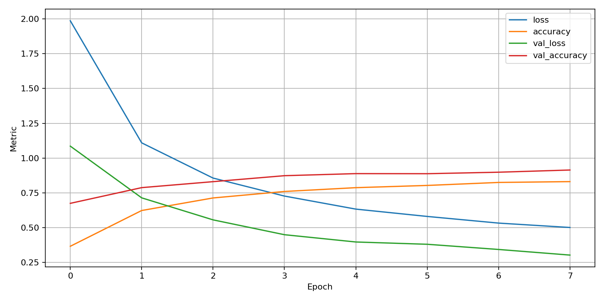
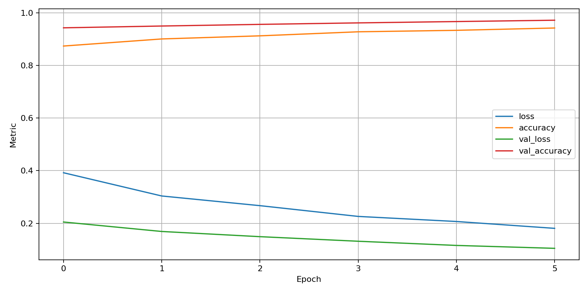
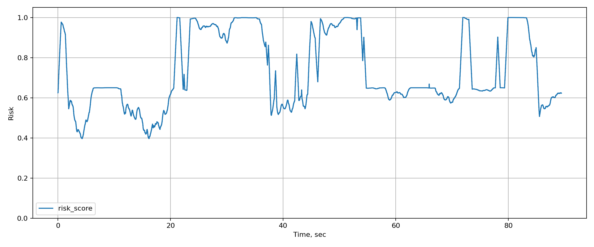
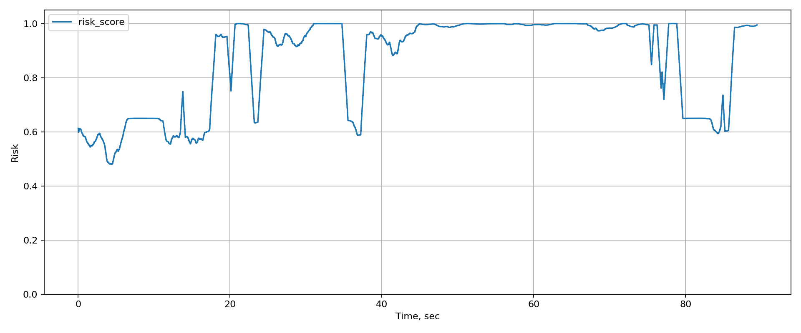

# Driver State Monitoring AI

Интеллектуальная система анализа состояния водителя по изображению, видеопотоку и данным с веб-камеры.

Проект решает задачу распознавания отвлечённого поведения водителя с использованием методов компьютерного зрения и глубокого обучения. Система классифицирует состояние водителя, оценивает уровень риска, формирует предупреждения и может применяться как прототип системы мониторинга безопасности движения.

---

## О проекте

В проекте реализованы:

* классификация состояния водителя по 10 классам;
* обучение нейросетевой модели на изображениях;
* анализ видеофайлов;
* обработка потока с веб-камеры;
* оценка риск-уровня поведения;
* сглаживание предсказаний во времени;
* генерация отчётов по сессии анализа;
* визуализация графика риска;
* web-интерфейс для запуска анализа;
* модульная структура проекта для дальнейшего развития.

---

## Классы распознавания

Модель классифицирует изображение по 10 состояниям:

| Код              | Класс                   | Описание                                        |
| ---------------- | ----------------------- | ----------------------------------------------- |
| c0_safe          | Безопасное вождение     | Водитель сосредоточен на дороге                 |
| c1_texting_right | Сообщение правой рукой  | Водитель пишет сообщение правой рукой           |
| c2_phone_right   | Телефон правой рукой    | Водитель разговаривает по телефону правой рукой |
| c3_texting_left  | Сообщение левой рукой   | Водитель пишет сообщение левой рукой            |
| c4_phone_left    | Телефон левой рукой     | Водитель разговаривает по телефону левой рукой  |
| c5_radio         | Магнитола               | Водитель взаимодействует с радио или панелью    |
| c6_drinking      | Напиток                 | Водитель пьёт                                   |
| c7_reaching      | Попытка достать предмет | Водитель тянется назад                          |
| c8_makeup        | Макияж / волосы         | Водитель отвлекается на внешний вид             |
| c9_talking       | Разговор с пассажиром   | Водитель повёрнут к пассажиру                   |

---

## Результаты классификации

Модель была протестирована на тестовой выборке из 3374 изображений.

Итоговые метрики:

| Метрика            | Значение |
| ------------------ | -------: |
| Accuracy           |   0.9727 |
| Macro Precision    |   0.9721 |
| Macro Recall       |   0.9730 |
| Macro F1-score     |   0.9723 |
| Weighted Precision |   0.9731 |
| Weighted Recall    |   0.9727 |
| Weighted F1-score  |   0.9727 |

Общая точность модели на тестовой выборке составила **97.27%**.

---

## Метрики по классам

| Класс            | Precision | Recall | F1-score | Support |
| ---------------- | --------: | -----: | -------: | ------: |
| c0_safe          |    0.9828 | 0.9144 |   0.9474 |     374 |
| c1_texting_right |    0.9941 | 0.9912 |   0.9927 |     341 |
| c2_phone_right   |    0.9942 | 0.9742 |   0.9841 |     349 |
| c3_texting_left  |    0.9538 | 0.9943 |   0.9736 |     353 |
| c4_phone_left    |    0.9775 | 0.9914 |   0.9844 |     350 |
| c5_radio         |    0.9885 | 0.9885 |   0.9885 |     348 |
| c6_drinking      |    0.9799 | 0.9743 |   0.9771 |     350 |
| c7_reaching      |    0.9675 | 0.9900 |   0.9787 |     301 |
| c8_makeup        |    0.9293 | 0.9583 |   0.9436 |     288 |
| c9_talking       |    0.9531 | 0.9531 |   0.9531 |     320 |

Наиболее уверенно модель распознаёт классы, связанные с использованием телефона, набором сообщений, взаимодействием с радио и употреблением напитка. Более сложными остаются классы `c0_safe`, `c8_makeup` и `c9_talking`, так как они могут визуально пересекаться с другими позами водителя.

---

## Графики обучения

В проекте сохранены графики обучения модели по этапам.

  

  <b>История обучения модели на первом этапе</b>

  

  <b>История обучения модели на втором этапе</b>

---

## График риска по видео

Для сессий анализа сохраняются графики изменения риск-уровня во времени.

  

  <b>Изменение риск-уровня в процессе анализа видео</b>

  

  <b>Пример графика риска для другой сессии</b>

---

## Используемые технологии

### Machine Learning

* Python
* TensorFlow
* Keras
* NumPy
* Pandas
* Scikit-learn

### Computer Vision

* OpenCV
* MediaPipe
* PIL

### Backend / Web

* FastAPI
* Uvicorn
* Jinja2
* HTML
* CSS
* JavaScript

### Анализ и визуализация

* Matplotlib
* CSV reports
* JSON reports

### Инструменты

* Git
* PyCharm
* YAML configuration
* Modular project structure

---

## Автор

**Алексей Молокин**
ML Engineer / Python Developer

GitHub: [molokinaleksej5](https://github.com/molokinaleksej5)
